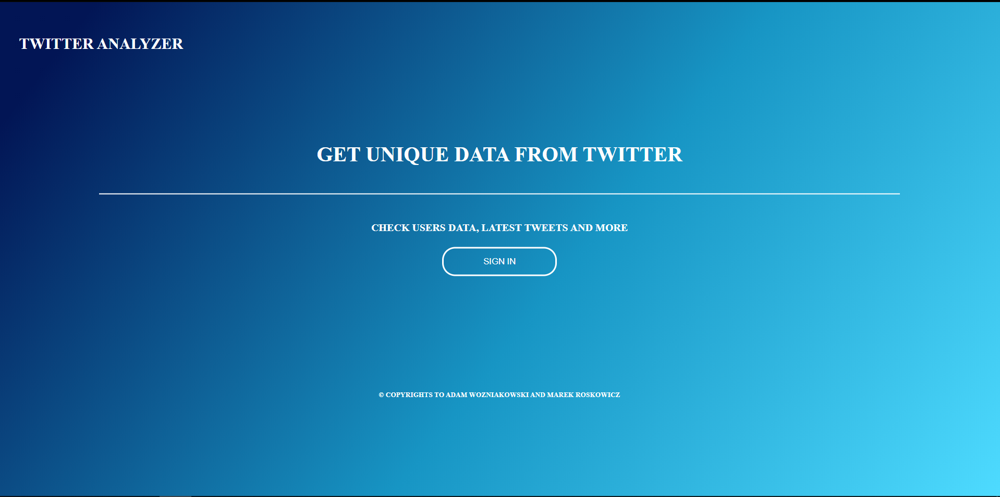

# Your Twitter 

## Overview
An application that allows you to download information from the Twitter API and present the results in a friendly, enjoyable way.  
Presentation and login to Twitter account is done via web application. 

## The application has been created with use:

- TwitterAPI and Twitter OAuth 1.0
- Spring-boot
- HTML, 
- CSS
- JavaScript
- Twitter4j libraries

## Preview

 After successfully logging in to the application, the user is presented with data:

The application allows the user to log in only from the localhost system
.
<ul>
<li>to get your information</li>
<li>First and last tweet</li>
<li>cloud of tags from the last X tweets</li>
</ul>

Session access pages are stored for the length of the session, i.e. until the browser is closed. 
The application also allows you to log out.

<h2>running applications</h2>

To launch applications, in the folder containing the project and pom.xml file, type the command  <b>mvn clean -D skipTests package spring-boot:run</b>.
  

## Authorization

Logging in to the application is via Twitter OAuth 1.0. When you click the SignIn button, you will be redirected to the Twitter login page. After correct login, the user will be redirected back to the application.

## Operation

The application uses SpringBoot in two ways. Default endpoint with value localhost:8080 respond with HTML page containing login.After successful login the second page of application available under endpoint /info/overview works like a SPA page.
To start the applications, type  in the folder containing the project and pom.xml file.
### `mvn clean -D skipTests package spring-boot:run`

## Operation

The application uses SpringBoot in two ways.Default endpoint at localhost:8080 respond with HTML page containing login. After successful login the second page of the application available at localhost:8080/info/overview works like a SPA application.  All data display activities take place on client side using code written in Javascript, CSS, HTML, while communication with Spring-a server takes place using REST standard. Communication with Twitter

